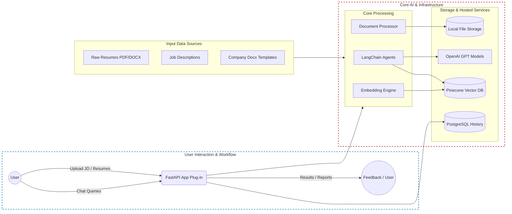
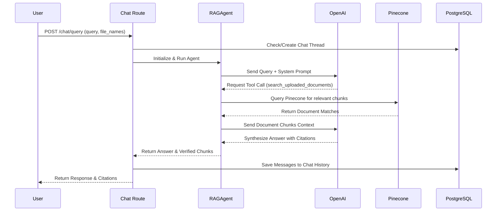
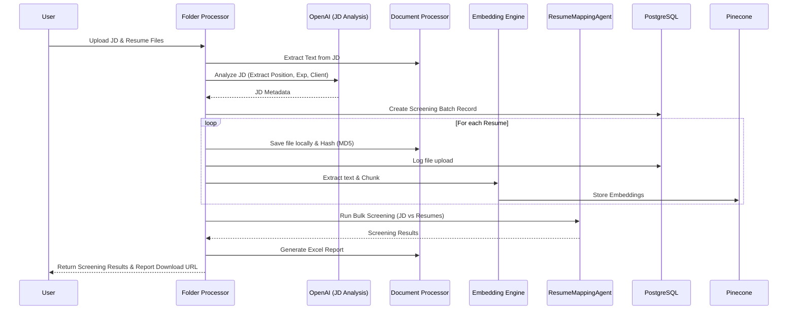
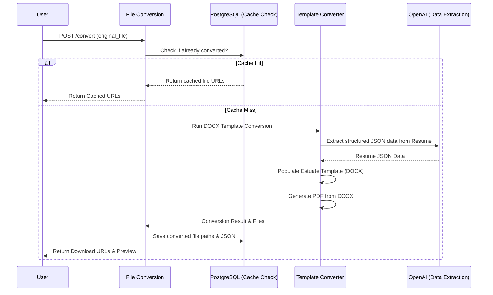

# Citation Generator Architecture & Workflows

This document outlines the architecture and core workflows of the Citation Generator application.

## 1. High-Level Architecture

The application is built using a modern Python tech stack, utilizing FastAPI for the backend, LangChain/OpenAI for LLM orchestration, PostgreSQL for relational data, and Pinecone for vector search.

### Key Components

*   **FastAPI Framework**: Serves as the main entry point (`app.py`), routing requests and handling middleware (authentication via cookies, CORS, request logging).
*   **LangChain Agents (`agents/`)**: 
    *   `RAGAgent`: Handles conversational chat, utilizing tools to search uploaded documents in Pinecone.
    *   `ResumeMappingAgent`: Specialized for comparing Job Descriptions against candidate resumes.
*   **Document Processing (`document_processing/`)**: Handles file loading, text extraction, chunking, and template-based document generation (e.g., converting a raw resume into a standardized company DOCX/PDF template).
*   **Embedding Engine (`embedding/`)**: Manages the generation of embeddings (likely OpenAI) and interacts with the Pinecone Vector Database.
*   **Database (`db/`)**: PostgreSQL used for relational data storage, including user accounts, file metadata, chat history, and bulk screening reports.

---

## 2. Core Workflows

### A. RAG Chat Workflow (`/chat/query`)
This workflow describes how a user asks a question and the system retrieves relevant document chunks to answer it with citations.

### B. Bulk Folder Processing & Screening Workflow (`/folder/process_folder`)
This workflow handles the upload of a Job Description and multiple resumes, screening the candidates against the JD.

### C. Resume Format Conversion Workflow (`/conversion/api/convert`)
This workflow standardizes candidate resumes into a specific company template format.

## Directory Structure Highlights
*   `agents/`: Contains LLM orchestration logic (`agents_main.py`, `agents_tool.py`, `agent_utils.py`).
*   `db/`: Database configuration and query endpoints.
*   `document_processing/`: Parsers, loaders, and template converters.
*   `embedding/`: Pinecone index management and text embedder.
*   `routes/`: FastAPI endpoints separated by domain (`chat.py`, `fileconverstion.py`, `folderprocesser.py`, etc.).
*   `converted_resumes/` & `uploaded_files/`: Local file storage.
